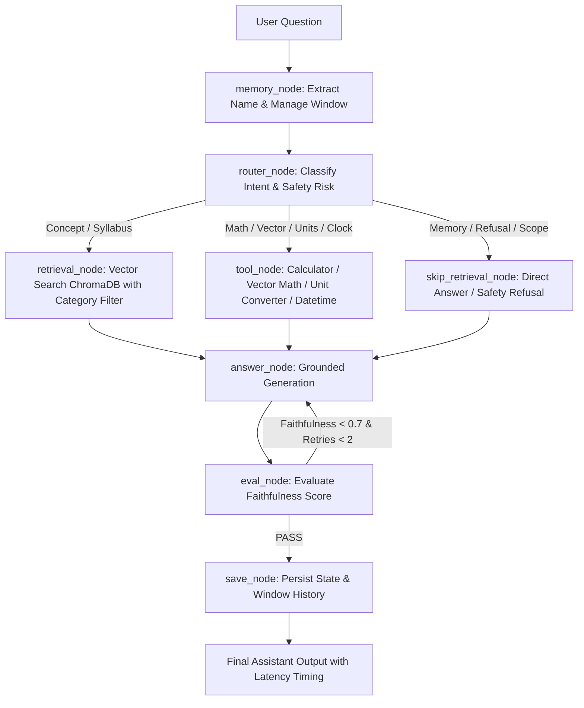

# ⚛️ Physics Study Buddy — Agentic AI Capstone

A grounded, high-faithfulness Agentic AI assistant built with **LangGraph**, **ChromaDB**, **Streamlit**, and **Pytest** for B.Tech Physics learners.

---

## 🌟 Architecture & System Flow



---

## ✨ Features & Capstone Highlights

- **LangGraph StateGraph Engine**: Built with an isolated 8-node state machine (`memory`, `router`, `retrieve`, `skip`, `tool`, `answer`, `eval`, `save`) featuring error-boundary recovery wrappers and turn latency tracking (`elapsed_seconds`).
- **Grounded Vector Search (RAG)**: Uses an in-memory ChromaDB collection populated with 12 focused B.Tech physics topic modules, bigram TF-IDF n-gram feature extraction, L2 normalized vector search, direct keyword search (`search_by_keyword`), and category query filtering with auto-fallback.
- **Thread Memory Persistence**: Full conversational context retention across turns managed with `MemorySaver`, `thread_id`, configurable sliding window size (`max_messages_window`), role-filtered history retrieval (`get_thread_history`), and full state snapshot inspection (`get_state_snapshot`).
- **Tool Scaffolding & Disambiguation**:
  - **Safe Math & Physics Calculator**: Evaluates arithmetic, physical constants (`g`, `c`, `h`, `kB`, `G`, `e_charge`, `pi`, `e`), scientific notation (`3e8`, `1.6e-19`), power exponents, modulo `%`, floor division `//`, degree trig (`sind`, `cosd`, `tand`), and inverse trig (`asin`, `acos`, `atan`).
  - **2D/3D Vector Calculator**: Computes vector magnitude, dot product, and 2D cross product.
  - **Physical Unit Converter**: Converts length, mass, time, energy, and temperature units (`convert_units`).
  - **Date/Time Tool**: Word-boundary regex disambiguates datetime queries from physics expressions (e.g. *time period of SHM* vs *current date*).
- **Safety & Injection Defense**: Weighted phrase scoring classifier detects prompt injection, system prompt leakage requests, and out-of-scope queries (`check_input_safety`).
- **Faithfulness Self-Evaluation Loop**: Automatically rates answer faithfulness against retrieved context and triggers targeted retries for low-scoring answers.
- **Deterministic Offline Fallback**: Fully functional without requiring external LLM cloud API keys, while supporting optional **OpenAI** or **Groq** backends.
- **Streamlit Web Interface**: Features LaTeX formula formatting (`$V=IR$`, `$F=ma$`), topic category dropdown & document breakdown, direct keyword search expander, JSON/Markdown chat export, metric badges, formula cheat-sheet, latency display, and expandable source cards.
- **CLI Executable**: Console script entry point `physics-buddy` supporting ANSI colorized terminal output, `--interactive`, `/reset`, `--category`, `--export-history`, `--json`, `--top-k`, `--verbose`, and `--version` flags.

---

## 🚀 Quickstart & Local Setup

```bash
# 1. Install dependencies
pip install -r submission_package/requirements.txt
pip install -e .

# 2. Run CLI executable
physics-buddy --question "What is Ohm's law?" --json

# 3. Run CLI in interactive chat mode
physics-buddy --interactive

# 4. Run vector math calculation example
physics-buddy --question "dot product of [1, 2, 3] and [4, 5, 6]"

# 5. Run the full pytest test suite
pytest

# 6. Run the Streamlit web application
streamlit run submission_package/capstone_streamlit.py
```

---

## ⚙️ Optional Environment Configuration

By default, the assistant runs in offline-deterministic mode. To connect hosted LLMs, export your API keys:

```bash
export OPENAI_API_KEY="your-openai-api-key"
# OR
export GROQ_API_KEY="your-groq-api-key"
```

---

## 🧪 Testing & Quality Assurance

Run the test suite to verify graph nodes, memory persistence, vector math tools, degree trig functions, physical constants, scientific notation, unit conversions, red-team prompt injections, category filtering, keyword search, and token estimation:

```bash
# Run pytest directly (19/19 passing)
pytest

# Or run the integrated test runner script
python submission_package/run_capstone_tests.py
```

---

## 📄 Key Project Files

- `submission_package/agent.py`: Command line interface with ANSI color output, `/reset`, `--category`, `--export-history`, `--json`, `--top-k`, and version flags.
- `submission_package/capstone_streamlit.py`: Browser-based Streamlit web application with category filters, direct keyword search, formula cheat-sheet & JSON/Markdown export.
- `submission_package/physics_study_buddy/`: Core agent library modules (`agent_core.py`, `knowledge_base.py`, `llm.py`, `tools.py`).
- `submission_package/tests/test_capstone.py`: Comprehensive Pytest suite (19/19 tests passing).
- `submission_package/report/generate_final_report.py`: Automated ReportLab PDF generator script with missing image fallback containers.
- `submission_package/report/project_documentation.md`: Detailed capstone documentation.


