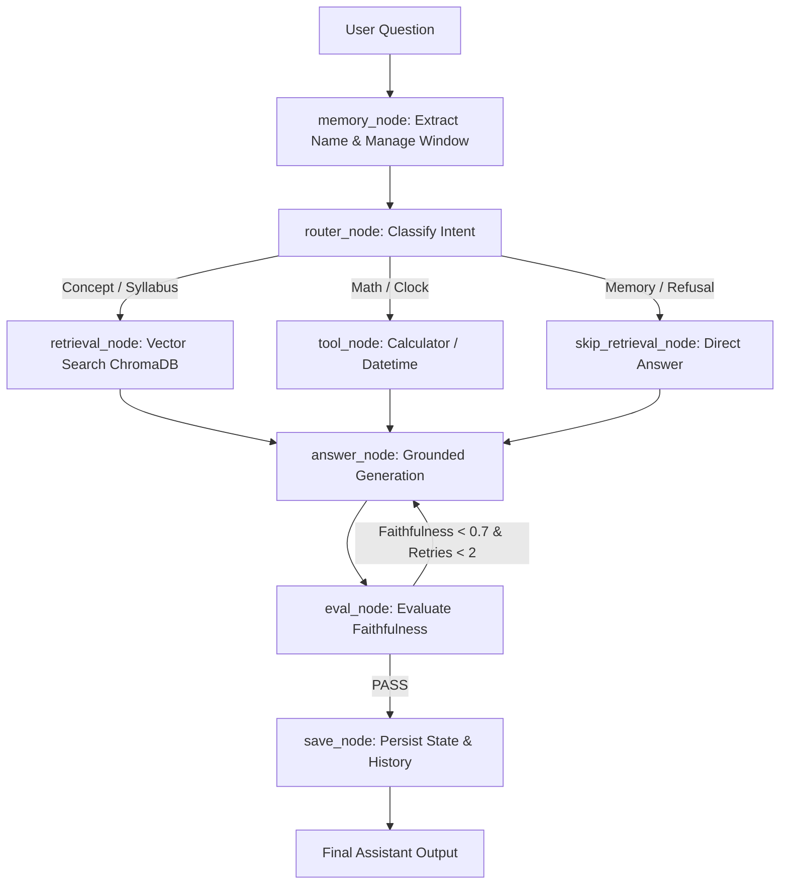

# ⚛️ Physics Study Buddy — Agentic AI Capstone

A grounded, high-faithfulness Agentic AI assistant built with **LangGraph**, **ChromaDB**, **Streamlit**, and **Pytest** for B.Tech Physics learners.

---

## 🌟 Architecture & System Flow



---

## ✨ Features & Capstone Highlights

- **LangGraph StateGraph Engine**: Built with an isolated 8-node state machine (`memory`, `router`, `retrieve`, `skip`, `tool`, `answer`, `eval`, `save`).
- **Grounded Vector Search (RAG)**: Uses an in-memory ChromaDB collection populated with 12 focused B.Tech physics topic modules categorized by domain.
- **Thread Memory Persistence**: Full conversational context retention across turns managed with `MemorySaver` and `thread_id`.
- **Tool Scaffolding & Disambiguation**:
  - **Safe Math Calculator**: Evaluates arithmetic, power exponents, modulo `%`, floor division `//`, and functions (`sqrt`, `sin`, `cos`, `tan`, `log`, `abs`, `radians`, `degrees`) with ZeroDivision, Overflow, and Math Domain error protection.
  - **Date/Time Tool**: Word-boundary regex disambiguates datetime queries from physics expressions (e.g. *time period of SHM* vs *current date*).
- **Faithfulness Self-Evaluation Loop**: Automatically rates answer faithfulness against retrieved context and triggers targeted retries for low-scoring answers.
- **Deterministic Offline Fallback**: Fully functional without requiring external LLM cloud API keys, while supporting optional **OpenAI** or **Groq** backends.
- **Streamlit Web Interface**: Features LaTeX formula formatting (`$V=IR$`, `$F=ma$`), topic category filtering, chat history export, metric badges, topic preset buttons, and expandable source cards.
- **CLI Executable**: Console script entry point `physics-buddy` supporting `--interactive`, `--json`, `--top-k`, `--verbose`, and `--version` flags.

---

## 🚀 Quickstart & Local Setup

```bash
# 1. Install dependencies
pip install -r submission_package/requirements.txt
pip install -e .

# 2. Run CLI executable
physics-buddy --question "What is Ohm's law?" --json

# 3. Run CLI in interactive chat mode
physics-buddy --interactive

# 4. Run the full pytest test suite
pytest

# 5. Run the Streamlit web application
streamlit run submission_package/capstone_streamlit.py
```

---

## ⚙️ Optional Environment Configuration

By default, the assistant runs in offline-deterministic mode. To connect hosted LLMs, export your API keys:

```bash
export OPENAI_API_KEY="your-openai-api-key"
# OR
export GROQ_API_KEY="your-groq-api-key"
```

---

## 🧪 Testing & Quality Assurance

Run the test suite to verify graph nodes, memory persistence, tool routes, red-team prompt injections, category filtering, and vector search:

```bash
# Run pytest directly (13/13 passing in <0.5s)
pytest

# Or run the integrated test runner script
python submission_package/run_capstone_tests.py
```

---

## 📄 Key Project Files

- `submission_package/agent.py`: Command line interface with interactive chat, JSON, top-k, and version flags.
- `submission_package/capstone_streamlit.py`: Browser-based Streamlit web application with category filters & export.
- `submission_package/physics_study_buddy/`: Core agent library modules (`agent_core.py`, `knowledge_base.py`, `llm.py`, `tools.py`).
- `submission_package/tests/test_capstone.py`: Comprehensive Pytest suite (13/13 tests passing).
- `submission_package/report/generate_final_report.py`: Automated ReportLab PDF generator script.
- `submission_package/report/project_documentation.md`: Detailed capstone documentation.
